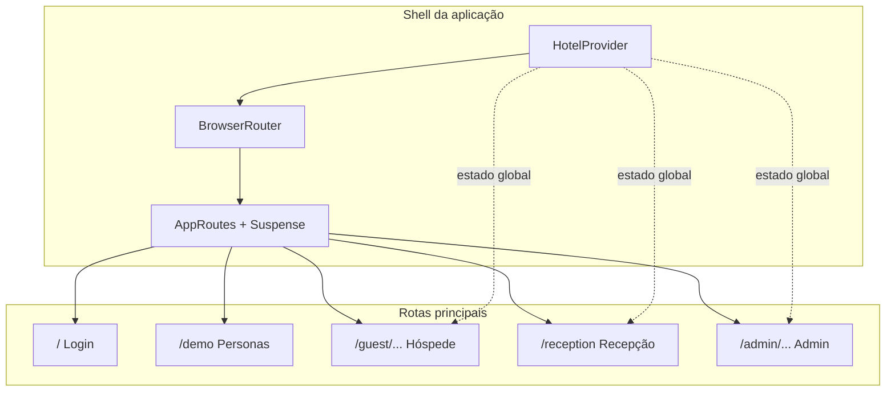

# Arquitetura do StayFlow

Documento de referência da estrutura técnica do front-end **StayFlow** (MVP de gestão hoteleira). O projeto é uma **SPA (Single Page Application)** em React, sem backend integrado: dados e autenticação são **mockados em memória** via React Context.

---

## 1. Visão geral

| Aspecto | Decisão |
|--------|---------|
| **Propósito** | Demonstrar jornadas de hóspede (pré-check-in, estadia, check-out), operação da recepção e painel administrativo. |
| **Execução** | Navegador; estado volátil (recarregar a página restaura o estado inicial mockado). |
| **Marca** | StayFlow; logo em `public/stayflow-logo.png`, componente `BrandLogo` com variante `onDark` para sidebars escuras. |



---

## 2. Stack tecnológica

- **Runtime / UI:** React 18, TypeScript.
- **Build:** Vite 7, plugin `@vitejs/plugin-react`.
- **Roteamento:** `react-router-dom` v6 (`BrowserRouter`, rotas aninhadas, `Navigate`).
- **Estilo:** Tailwind CSS 4 via `@tailwindcss/vite`; tokens em `src/styles/theme.css` (inclui variáveis estilo shadcn); utilitários `clsx` + `tailwind-merge` (função `cn` em componentes).
- **Componentes base:** Primitivos estilo shadcn (`src/app/components/ui/`), parte com **Radix UI** (avatar, dialog, slider, switch).
- **Feedback:** `sonner` (toasts), globais em `App.tsx`.
- **Gráficos:** Recharts (dashboards admin/recepção).
- **Formulários / utilidades:** `react-hook-form` (telas que precisam); `date-fns`; `lucide-react` (ícones); `motion`; `react-signature-canvas`, `react-easy-crop`, `react-qr-code` em fluxos específicos de hóspede/admin.

**Alias:** `@` → `src/` (definido em `vite.config.ts`).

---

## 3. Estrutura de pastas (relevante)

```
StayFlow/
├── index.html                 # Ponto de entrada HTML
├── public/                    # Estáticos servidos na raiz (ex.: stayflow-logo.png)
├── vite.config.ts
├── package.json
└── src/
    ├── main.tsx               # createRoot + App + CSS global
    ├── styles/                # index.css, tailwind.css, theme.css, fonts.css
    └── app/
        ├── App.tsx            # Provider + Router + Toaster + AppRoutes
        ├── context/
        │   └── HotelContext.tsx   # Estado global + dados mock + ações
        ├── routes/
        │   ├── paths.ts         # PATHS / ROUTE_PATTERNS (URLs centralizadas)
        │   ├── AppRoutes.tsx   # Definição de rotas + React.lazy
        │   ├── RouteFallback.tsx
        │   └── index.ts
        ├── pages/
        │   ├── LoginPage.tsx
        │   ├── LandingPage.tsx   # Demo personas (João/Maria/Carlos)
        │   ├── guest/            # Fluxo hóspede
        │   ├── reception/       # Painel recepção (monólito grande)
        │   └── admin/           # Layout + páginas admin
        ├── components/
        │   ├── BrandLogo.tsx
        │   ├── figma/
        │   ├── guest/           # ex.: GuestBottomNav
        │   └── ui/              # Design system leve (button, card, input…)
        └── utils/
            └── canvasUtils.ts
```

Arquivos **não plugados nas rotas** (legado ou reserva): por exemplo `GuestLogin.tsx`, `PreCheckin.tsx` — podem ser reaproveitados ou removidos numa limpeza futura.

---

## 4. Camada de aplicação (`App.tsx`)

Ordem de composição:

1. **`HotelProvider`** — envolve toda a árvore; disponibiliza hóspedes, quartos, reservas, logs, usuário de atendimento simulado e funções de mutação.
2. **`BrowserRouter`** — flags de future do React Router v7 (`v7_startTransition`, `v7_relativeSplatPath`).
3. **`AppRoutes`** — árvore de rotas dentro de `Suspense` (carregamento preguiçoso).
4. **`Toaster`** — notificações Sonner (`top-center`, `richColors`).

Não há camada de API, interceptors ou React Query: toda persistência é local ao ciclo de vida da aba.

---

## 5. Roteamento (`src/app/routes/`)

### 5.1 Convenções

- **`PATHS`** — URLs absolutas para `navigate()`, `Link` `to`, redirecionamentos. Inclui funções parametrizadas em `PATHS.guest.*` (ID da reserva).
- **`ROUTE_PATTERNS`** — segmentos usados em `<Route path="...">`, inclusive rotas relativas filhas de `/admin`.

Fonte única: **`paths.ts`**. Evita strings mágicas espalhadas pelas páginas.

### 5.2 Mapa de rotas (MVP)

| Caminho | Página | Notas |
|---------|--------|--------|
| `/` | `LoginPage` | Entrada; atalhos demo (pré-check-in, recepção, admin). |
| `/demo` | `LandingPage` | Três personas + acesso recepção/admin. |
| `/guest/checkin/:id` | `GuestPreCheckin` | Pré-check-in com assinatura. |
| `/guest/:id` | `GuestDashboard` | Painel do hóspede. |
| `/guest/profile/:id` | `GuestProfile` | Dados e avatar. |
| `/guest/notifications/:id` | `GuestNotifications` | Notificações mockadas. |
| `/reception` | `ReceptionDashboard` | Operação diária (chegadas, quartos, etc.). |
| `/admin` | `AdminLayout` + `Outlet` | Redireciona para `dashboard`. |
| `/admin/dashboard` … | Várias | `AdminDashboard`, `AdminSettings`, `AdminStructure`, `AdminUsers`, `AdminFinance`, `AdminPolicies`, `AdminAudit`, `AdminHealth`. |
| `*` | Redireciona para `PATHS.home` | Hoje equivalente a `/` (login). |

### 5.3 Code splitting

`AppRoutes.tsx` importa páginas com **`React.lazy`**. Enquanto o chunk carrega, exibe **`RouteFallback`** (spinner + “Carregando…”).

---

## 6. Estado global (`HotelContext`)

**Arquivo:** `src/app/context/HotelContext.tsx`.

### 6.1 Modelo de domínio (tipos exportados)

- **`Guest`** — identidade, contato, documento, assinatura (base64), avatar, notas.
- **`Room`** — número, tipo, status operacional (`VACANT_CLEAN`, `OCCUPIED`, etc.).
- **`Reservation`** — vínculo `guestId`, datas, `status` (máquina de estados do hóspede), despesas, saldo.
- **`Expense`** / **`RevenueStat`** / **`Log`** — financeiro simplificado e trilha de auditoria leve.

### 6.2 Status de reserva (`ReservationStatus`)

Representa o fluxo: convite → pré-check-in → hospedado → pendência de saída → finalizado (e estados exceção como `NO_SHOW`, `CANCELLED`).

### 6.3 API do contexto

Lê arrays mockados iniciais e expõe ações como `updateReservationStatus`, `updateGuestData`, `assignRoom`, `updateRoomStatus`, `addExpense`, `addLog`, `switchUser` (tropeço de “quem está no balcão”), etc.

**Hook:** `useHotel()` — lança erro se usado fora do `HotelProvider`.

### 6.4 Limitações conscientes

- Sem validação server-side, sem JWT, sem filas.
- Ideal para **protótipo / demo**; produção exigiria API, auth, persistência e regras de negócio no servidor.

---

## 7. Módulos funcionais

### 7.1 Autenticação (UI apenas)

`LoginPage` valida formato de e-mail e presença de senha; mensagens explicam que não há servidor de auth. Os atalhos levam direto às rotas demo. **Sair** das outras áreas costuma usar `PATHS.home` → volta ao login.

### 7.2 Hóspede (`pages/guest/`)

Fluxo por **ID de reserva** na URL. Componentes reutilizam `useHotel` para ler/atualizar reserva e hóspede. Navegação inferior (`GuestBottomNav`) em parte do fluxo.

### 7.3 Recepção (`pages/reception/ReceptionDashboard.tsx`)

Interface densa (abas internas, modais, gráficos): chegadas, in-house, saídas, gestão de quartos, painéis com Recharts. Consome o mesmo contexto.

### 7.4 Administrativo (`pages/admin/`)

- **`AdminLayout`** — sidebar escura (`slate-900`), navegação por `PATHS.admin.*`, **logo** com `BrandLogo variant="onDark"`.
- **Filhos** — cada arquivo é uma rota; `Outlet` renderiza o conteúdo.

Algumas rotas admin existem em `PATHS` / `AppRoutes`, mas **nem todas** aparecem no menu lateral atual (ex.: financeiro, auditoria, saúde) — extensível no layout.

---

## 8. Camada de UI

- **`components/ui/`** — botões, cards, inputs, dialogs, tabelas, etc.; padrão visual alinhado ao ecossistema shadcn (variantes, `rounded-xl`, foco `sky`).
- **`components/BrandLogo.tsx`** — imagem em `public/`; variante **`onDark`** aplica filtros CSS para logo branco em fundos escuros.
- **Tema** — `theme.css` define variáveis CSS (`--primary`, `--sidebar`, chart colors); Tailwind consome utilitários nas telas; modo `.dark` preparado nas variáveis.

---

## 9. Assets e estáticos

- **`public/`** — arquivos copiados como estão para a raiz do build (ex.: `stayflow-logo.png`).
- **`src/assests/`** (grafia do repositório) — pode conter cópias locais do logo; **referência canônica em runtime** para o `BrandLogo` é o caminho em `public/`, salvo se alterado no componente.

---

## 10. Scripts e build

```bash
npm i          # dependências
npm run dev    # servidor de desenvolvimento Vite
npm run build  # saída em dist/
```

Saída de produção: HTML único + chunks JS/CSS nomeados por hash; lazy loading gera chunks por rota/página.

---

## 11. Evolução recomendada (fora do escopo atual)

- API REST/GraphQL + autenticação real (OIDC, JWT, sessão).
- Camada `services/` ou `api/` + React Query / TanStack Query.
- Separação do `ReceptionDashboard` em submódulos (hooks + componentes por domínio).
- Testes (Vitest + Testing Library) e CI.
- Contrato de tipos compartilhados com o backend (OpenAPI / codegen).

---

## 12. Documentos relacionados

- **`README.md`** — como rodar o projeto e link de referência de design (Figma).
- **`ATTRIBUTIONS.md`** — créditos (shadcn/ui, Unsplash).

---

*Última atualização alinhada à estrutura do repositório StayFlow (front-end MVP).*
